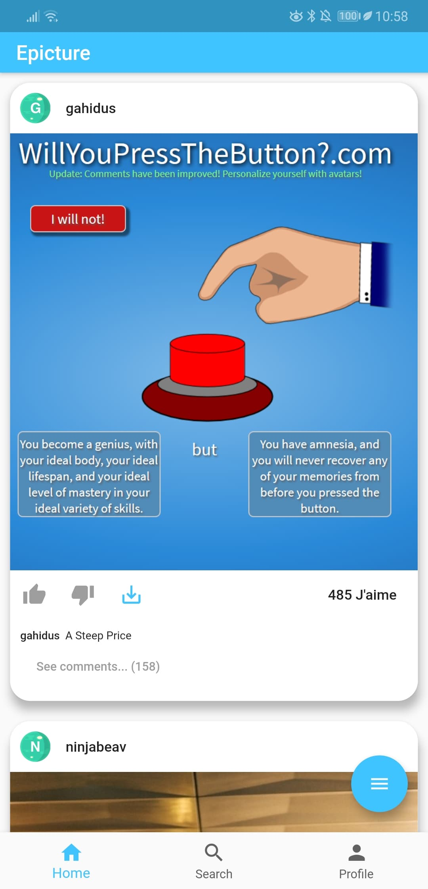
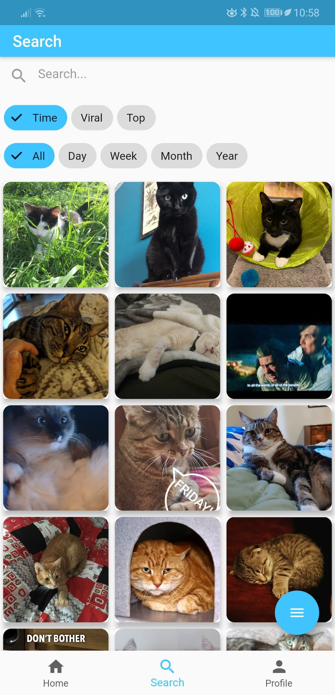
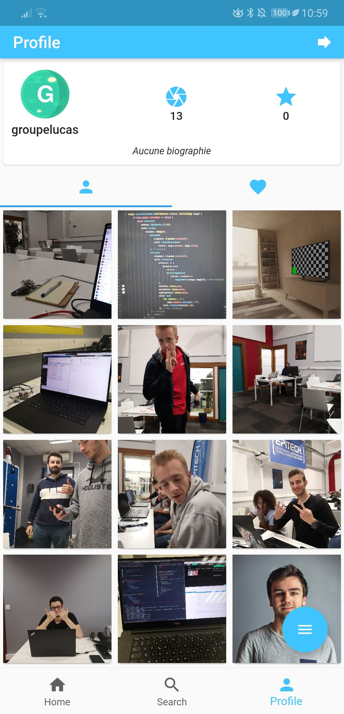

# Epicture

Epicture is a small instagram replica using the imgur API.
You'll be able to :
- Authenticate to the Imgur platform
- Use the feed, most virals publications, and react to them
- Search for images, and filter the result
- See your profile informations, your images, and your favorites images
- Upload new photo from your camera or your gallery

Epicture is using the imgur API: https://apidocs.imgur.com

## Development environment

### Flutter

#### The Imgur API

Epicture is powered by flutter. The application is cross-platform, and compiled in either 
Kotlin or Swift.

The API implementation uses **JsonSerialization** to create API models. It allows to write understandable API requests.
All models are visible in _models_ directory.

All the JSON-Class and Class-JSON conversions are auto-generated by flutter engine using :

``
$>  flutter pub run build_runner build --delete-conflicting-outputs
``

All request are done through _managers_ and are asynchronous. Most of the Epicture Widget are Statefull

### UI - UX

The UI is powered by the Material Theme. All widgets from this theme are available here: https://flutter.dev/docs/development/ui/widgets/material

Some plugins are used to beautify the app or speed up the development, for instance:

- flutter_webview_plugin: ^0.3.8
- shared_preferences: ^0.5.3+4
- camera: ^0.5.5+1
- image_picker: ^0.6.1+4
- flutter_speed_dial: ^1.2.1

## User Documentation

### Feed

The feed is where you are going to spend most of your time. It displays the most viral imgur posts, you can react by voting up or down.
If you want to, you can save it in your favorite using the _download_ icon. You can as well see all comments, react to them, or post your own.

### Search

The search screens allows you to search image by name. You can tap on images vote, comment, or add to your favorites.
You can use the Chips to sort the result.

### Profile

The profile view reference your personal information. Such as your number of posts, your public rating. You can as well see all your publications and your favorites using the tab bar navigation.

